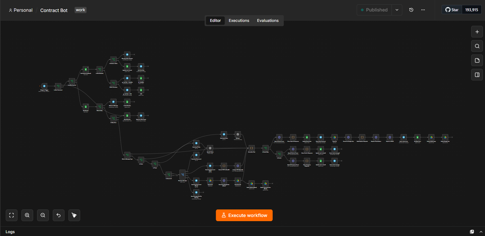

# 📄 Contract Bot — Telegram Bot for Transport Contract Automation

> Built for a real logistics business. Not a pet project — runs in production.

A Telegram bot that turns a 20-minute manual contract drafting process into a 2-minute conversation. The dispatcher sends company details (as text, voice message, photo, PDF, or Word doc), the bot parses everything with AI, fills in the template, and returns a ready-to-sign `.docx` contract.

**Live since:** 2025 | **Contracts generated:** daily use | **Downtime:** zero (Railway + n8n)

---

## 🎯 Why This Exists

Every transport company deals with the same pain: contracts need to be generated fast, the details change every time (different clients, carriers, routes), and the person doing it is usually a dispatcher — not an office manager.

The old way: open Word, find last contract, edit manually, save, send. Takes 15–20 minutes, easy to make a mistake, hard to track.

The new way: open Telegram, paste the client's details, get a contract in 2 minutes.

---

## ✨ What It Does

- **4 contract types** across 2 legal entities (АвтоМув — sole proprietor, no VAT; ЮТС — VAT registered)
  - Client-side contracts (З)
  - Carrier-side contracts (П)

- **Multi-modal input** — the dispatcher can send data however it's convenient:
  - Plain text
  - Voice message (transcribed via Whisper)
  - Photo of a document (extracted via GPT-4o Vision)
  - PDF (processed inline via OpenAI Responses API)
  - Word `.docx` (converted via Google Drive)

- **3 AI parsers** on GPT-4.1-mini with strict JSON schema output:
  - Company Parser — extracts client details, handles Ukrainian legal entity types (ТОВ, ФОП, ПП)
  - Carrier Parser — same for the carrier side
  - Route Parser — extracts route, cargo, dates, contacts

- **Auto-generated `.docx`** — copies the right template from Google Drive, replaces 30+ placeholders, delivers to Telegram

- **Error handling** — separate workflow catches failures, notifies both the user and the admin via Telegram

- **Session state** in Google Sheets — every conversation step is tracked, so partial inputs are never lost

---

## 🏗️ Architecture

```
Telegram Input
      │
      ├─ text / voice / photo / PDF / docx
      │         │
      │    [Media Router]
      │         │
      │    Whisper / GPT-4o Vision / Drive conversion
      │
      ▼
[Session Manager] ←→ Google Sheets (Sessions)
      │
      ├── Step: collect_data  → [OpenAI Company Parser]
      ├── Step: collect_carrier → [OpenAI Carrier Parser]  
      └── Step: collect_route → [OpenAI Route Parser]
                                        │
                              [Build Replace Requests]
                                        │
                              [Google Drive: Copy Template]
                                        │
                              [Google Drive: Batch Replace]
                                        │
                              [Telegram: Send .docx]
```

Two workflows:
- `contract_bot_main` — the full conversation flow (~30 nodes)
- `contract_bot_error_handler` — catches any execution failure, notifies user + admin

---

## 🛠️ Tech Stack

| Layer | Tool |
|---|---|
| Automation engine | n8n 2.20.x |
| Hosting | Railway |
| Messenger | Telegram Bot API |
| Session storage | Google Sheets |
| Document templates | Google Drive + Docs |
| AI parsing | OpenAI GPT-4.1-mini (structured output) |
| Voice transcription | OpenAI Whisper |
| Document OCR | OpenAI GPT-4o Vision |
| PDF processing | OpenAI Responses API (base64 inline) |

---

## 📸 Demo

### Bot conversation flow


### Workflow overview


---

## 🚀 Deploy It Yourself

### Prerequisites

- n8n instance (Railway, self-hosted, or n8n Cloud)
- Telegram Bot token ([@BotFather](https://t.me/BotFather))
- Google Cloud project with Drive, Docs, Sheets APIs enabled
- OpenAI API key

### Step 1 — Google Setup

1. Create a Google Cloud project
2. Enable APIs: Google Drive API, Google Docs API, Google Sheets API
3. Create OAuth 2.0 credentials (Desktop app)
4. In OAuth consent screen → set Publishing status to **In production** (important — otherwise tokens expire every 7 days)

### Step 2 — Prepare Templates

1. Create 4 contract templates in Google Drive (`.docx` format)
2. Add placeholders in `{{PLACEHOLDER_NAME}}` format (see full list below)
3. Note down the file IDs from the Drive URLs

### Step 3 — Google Sheets Sessions

Create a spreadsheet with a sheet named `Sessions` and these columns:

```
A: chat_id | B: step | C: company | D: role | E: data | F: updated_at | G: raw_input
```

### Step 4 — Import Workflows to n8n

1. In n8n: **Workflows → Import from file**
2. Import `workflows/contract_bot_main.json`
3. Import `workflows/contract_bot_error_handler.json`
4. Set the error handler: open main workflow → Settings → Error Workflow → select `Contract Bot — Error Handler`

### Step 5 — Configure Credentials

In n8n, create the following credentials:

| Credential name | Type |
|---|---|
| Telegram Bot | Telegram API |
| Google Sheets account | Google OAuth2 |
| Google Drive account | Google OAuth2 |
| Google Docs account | Google OAuth2 |
| OpenAI account | OpenAI API |
| OpenAI Header Auth | HTTP Header Auth (Bearer) |

### Step 6 — Update Node Settings

After import, update these values across the workflows:

- **Google Sheets nodes** — replace Spreadsheet ID with yours
- **Google Drive nodes** — replace template File IDs with yours
- **Telegram nodes** — re-link to your Telegram credential
- All credentials — re-link to your configured credentials

### Step 7 — Activate & Test

1. Activate both workflows
2. Open Telegram, find your bot, send `/start`
3. Follow the conversation flow

---

## 📋 Placeholder Reference

### Client / Carrier fields
| Placeholder | Description |
|---|---|
| `{{CONTRACT_NUMBER}}` | Contract number |
| `{{CONTRACT_DATE}}` | Contract date |
| `{{CLIENT_COMPANY}}` | Full legal name |
| `{{CLIENT_COMPANY_SHORT}}` | Short name for signature block |
| `{{CLIENT_DIRECTOR}}` | Full name (Прізвище Ім'я По-батькові) |
| `{{CLIENT_DIRECTOR_SHORT}}` | Last name + initials |
| `{{CLIENT_BASIS}}` | Legal basis (Статуту / паспорта) |
| `{{CLIENT_ADDRESS}}` | Legal address |
| `{{CLIENT_EDRPOU}}` | Tax code (8 digits ТОВ/ПП, 10 digits ФОП) |
| `{{CLIENT_IBAN}}` | IBAN without UA prefix |
| `{{CLIENT_BANK}}` | Bank name |
| `{{CLIENT_IPN}}` | Tax ID |
| `{{CLIENT_PHONE}}` | Phone |
| `{{CLIENT_EMAIL}}` | Email |
| `{{CLIENT_CONTACT}}` | Contact person |

*(Same pattern for `CARRIER_*` fields)*

### Route fields
| Placeholder | Description |
|---|---|
| `{{ROUTE}}` | Route description |
| `{{CARGO_INFO}}` | Cargo description |
| `{{LOADING_ADDRESS}}` | Loading point |
| `{{LOADING_DATE}}` | Loading date |
| `{{UNLOADING_ADDRESS}}` | Delivery point |
| `{{DELIVERY_DATE}}` | Delivery date |
| `{{VEHICLE_INFO}}` | Vehicle details |
| `{{DRIVER_INFO}}` | Driver details |
| `{{SERVICE_PRICE}}` | Forwarding fee |
| `{{TRANSPORT_PRICE}}` | Transport fee |

---

## 💡 Key Technical Decisions & Lessons Learned

A few things that weren't obvious and took real debugging to figure out:

**Structured output over free-form parsing**
Switched from Groq llama to GPT-4.1-mini with `json_schema` + `strict: true`. Eliminates the need for output cleaning nodes — the model either returns valid JSON or errors, no in-between.

**Google Drive copy + format conversion in one request**
n8n's built-in Drive "Copy" node doesn't expose the `mimeType` override field. Used raw HTTP Request to `files.copy` endpoint with `mimeType: application/vnd.openxmlformats-officedocument.wordprocessingml.document` — copies and converts in a single API call.

**Google OAuth token expiry**
If your tokens keep expiring every 7 days — the fix is in Google Cloud Console: OAuth consent screen → Publishing status → **In production**. Not in n8n.

**n8n filesystem binary storage**
On Railway with filesystem binary storage, `.data` is an internal reference string, not base64. Use `await this.helpers.getBinaryDataBuffer(0, 'data')` to get actual binary content.

**Session state without a database**
Google Sheets works surprisingly well as a lightweight session store for a single-user-at-a-time bot. Each row = one active conversation. Simple, auditable, no extra infrastructure.

---

## 📁 Repository Structure

```
contract-bot-n8n/
├── README.md
├── ARCHITECTURE.md
├── .env.example
├── workflows/
│   ├── contract_bot_main.json
│   └── contract_bot_error_handler.json
├── docs/
│   ├── screenshots/
│   └── setup_guide.md
└── templates/
    └── README.md
```

---

## 🔮 What's Next (v2.0)

- Multi-message input accumulation — dispatcher can send data across several messages, bot collects everything before parsing
- "Both" role option — generate client + carrier contracts in one session sequentially  
- Persistent reply keyboard instead of inline buttons
- Contract history log in Sheets

---

## 👤 Author

Built by **Yevhen** — logistics automation, n8n, AI integration.

> This project started as a solution to a real problem in my own business. It grew into something I'm genuinely proud of — production-stable, actually used daily, and built with real constraints (budget, time, one person).

---

## 📄 License

MIT — use it, fork it, build on it.
